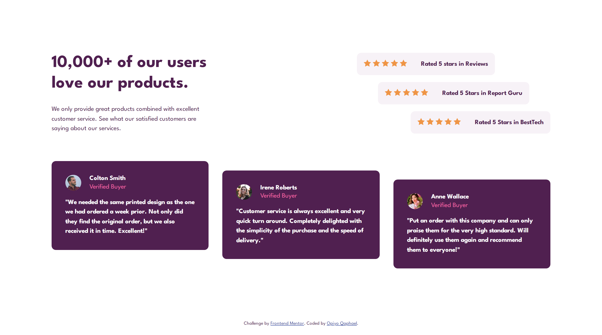

# Frontend Mentor - Social proof section solution

This is a solution to the [Social proof section challenge on Frontend Mentor](https://www.frontendmentor.io/challenges/social-proof-section-6e0qTv_bA). Frontend Mentor challenges help you improve your coding skills by building realistic projects. 

## Table of contents

-   [Overview](#overview)
  - [The challenge](#the-challenge)
  - [Screenshot](#screenshot)
  - [Links](#links)
  - [Built with](#built-with)
  - [What I learned](#what-i-learned)
  - [Useful resources](#useful-resources)
  - [Author](#author)


## Overview
This is the front end mentor challenge recreation of Social proof section solution I did following my other frontend mentor code challenges

### The challenge

Users should be able to:

- View the optimal layout for the interface depending on their device's screen size

### Screenshot




### Links

- Solution URL: [Add solution URL here](https://your-solution-url.com)
- Live Site URL: [Add live site URL here](https://your-live-site-url.com)

## My process

### Built with

- Semantic HTML5 markup
- CSS custom properties
- Flexbox
- CSS Grid
- vscode

### What I learned

I learned and practiced a great deal of flex property in this challenge for positioning

### Code Snippet I'm Proud of

```html
<h1>Some HTML code I'm proud of</h1>

<div class="pro-box">
<div class="profile-img-box">
  
</div>
<div class="profile-detail-box">
  <p class="name">Colton Smith</p>
  <p class="post">Verified Buyer</p>
</div>
</div>
```
```css
.proud-of-this-css {
  color: papayawhip;
}

.row-one {
  display: flex;
  align-items: start;
}
.row-two {
  display: flex;
  align-items: center;
}
.row-three {
  display: flex;
  align-items: end;
}

.top-right-side .row-one {
  display: flex;
  justify-content: start;
}

.top-right-side .row-two {
  display: flex;
  justify-content: center;
}

.top-right-side .row-three {
  display: flex;
  justify-content: end;
}

```

### Useful resources

- [unicon icons ](https://iconscout.com/unicons) - This helped me for icons.
- [google fonts](https://fonts.google.com/) - This helped me for fonts i used in this challenge.

## Author

- Website - [Qaphael Opiyo](https://qaphael-portfolio-website.web.app/)
- Frontend Mentor - [@Qaphael](https://www.frontendmentor.io/profile/Qaphael)
- Twitter - [@lafl_lr](https://twitter.com/Laflo_lr)
- Github - [@Qaphael](https://github.com/Qaphael)

